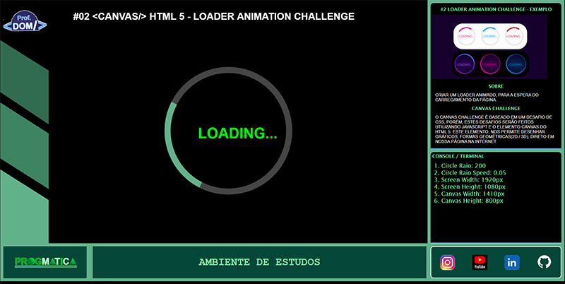

# CHALLENGE CANVAS HTML 5

O CANVAS CHALLENGE É BASEADO EM UM DESAFIO DE CSS, PORÉM, ESTES DESAFIOS SERÃO FEITOS UTILIZANDO JAVASCRIPT E O ELEMENTO CANVAS DO HTML 5.

ESTE ELEMENTO HTML, NOS PERMITE DESENHAR GRÁFICOS, FORMAS GEOMÉTRICAS(2D / 3D), DENTRO DA ESTRUTURA
DE NOSSA PÁGINA NA INTERNET.

# CHALLENGE 01 - HOVER ANIMATION

CRIAR UM BOTAO COM HOVER ANIMADO.

# CHALLENGE 02 - AUTOLOADING

CRIAR UM AUTOLOADING ANIMADO, PARA A ESPERA DO CARREGAMENTO DA PÁGINA.
<figure>

<figcaption>Tela do Challenge 02 com o autoloading</figcaption>
</figure>